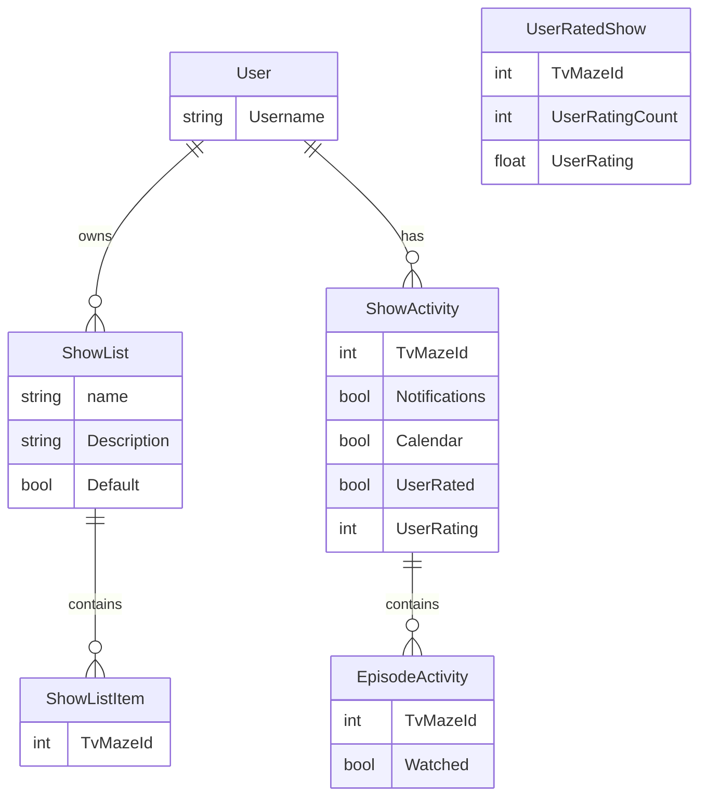

# TvTrackServer

Please note that the implementation of the server is not perfect and is lacking the proper structure, because the aim of this project was to concentrate on the mobile app instead and this server’s role is only to support data to it.

## Known limitations

- The server DOES NOT check the validity of tvMazeIds supplied in POST requests. This may result in unexpected errors when the server tries to match the invalid tvMazeIds with actual TvMaze response in endpoints such as GET shows.

## Data diagram

Of the data stored in our databases (not from TvMaze api).

